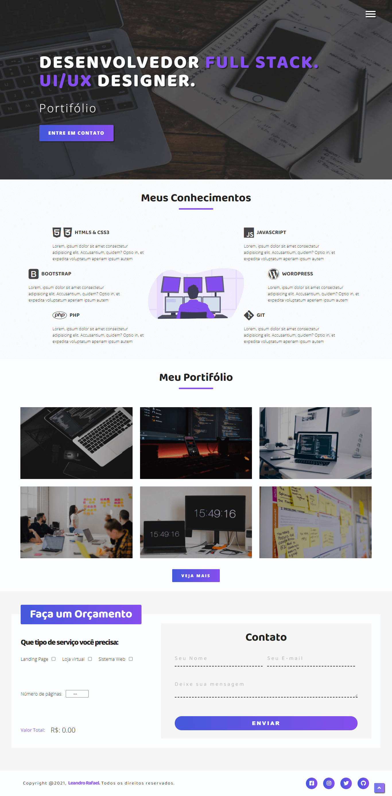
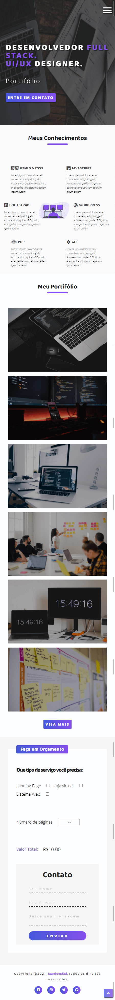

<div align ="center">

# Site completo com HTML5, CSS3 & JAVASCIPT

</div>

Esse projeto foi desenvolvido com o objetivo de colocar em prática meus conhecimentos em HTML5, CSS3 & JAVASCRIPT puro. Nesse projeto eu simulo um portifólio de um desenvolvedor web. Aqui eu utilizo também Mobile First e FLEXBOX para deixar o site responsivo.

- Demo: [Clique aqui para ver esse projeto](https://leandro-br.github.io/site-completo/)

## Desktop:
<div align="center">
    
</div>

## Mobile:
<div align="left">
    
</div>

## Tecnologias:
Esse projeto foi desenvolvido com as seguintes tecnologias:

- HTML5
- CSS3
- JAVASCRIPT

## Como usar:

```bash
# Clone this repository
$ git clone https://github.com/leandro-br/site-completo
```

## Autor: 
 

#### Leandro Rafael

[](https://www.linkedin.com/in/leandrorafael-dev/) [](https://twitter.com/leandrorafaelBR) 

## Licença:
[](https://opensource.org/licenses/MIT)

Este projeto está sob licença do MIT. Veja a licença para mais informações:

[Veja o Copyright](https://github.com/leandro-br/site-completo/blob/master/LICENSE)
